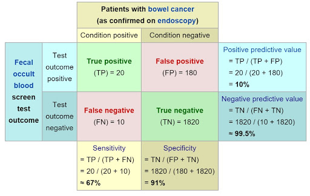

```{r setup, include=FALSE}
knitr::opts_chunk$set(echo = TRUE)
```

## About the Data

Dr Robert Lyon

HTRU2 is a data set which describes a sample of pulsar candidates collected during the High Time Resolution Universe Survey .

Pulsars are a rare type of Neutron star that produce radio emission detectable here on Earth. They are of considerable scientific interest as probes of space-time, the inter-stellar medium, and states of matter .

As pulsars rotate, their emission beam sweeps across the sky, and when this crosses our line of sight, produces a detectable pattern of broadband radio emission. As pulsars
rotate rapidly, this pattern repeats periodically. Thus pulsar search involves looking for periodic radio signals with large radio telescopes.

Each pulsar produces a slightly different emission pattern, which varies slightly with each rotation . Thus a potential signal detection known as a 'candidate', is averaged over many rotations of the pulsar, as determined by the length of an observation. In the absence of additional info, each candidate could potentially describe a real pulsar. However in practice almost all detections are caused by radio frequency interference (RFI) and noise, making legitimate signals hard to find.

Machine learning tools are now being used to automatically label pulsar candidates to facilitate rapid analysis. Classification systems in particular are being widely adopted,
which treat the candidate data sets as binary classification problems. Here the legitimate pulsar examples are a minority positive class, and spurious examples the majority negative class.

The data set shared here contains 16,259 spurious examples caused by RFI/noise, and 1,639 real pulsar examples. These examples have all been checked by human annotators.

Each row lists the variables first, and the class label is the final entry. The class labels used are 0 (negative) and 1 (positive).

Attribute Information: Each candidate is described by 8 continuous variables, and a single class variable. The first four are simple statistics obtained from the integrated pulse profile (folded profile). This is an array of continuous variables that describe a longitude-resolved version of the signal that has been averaged in both time and frequency . The remaining four variables are similarly obtained from the DM-SNR curve . These are summarised below:

Mean of the integrated profile.
Standard deviation of the integrated profile.
Excess kurtosis of the integrated profile.
Skewness of the integrated profile.
Mean of the DM-SNR curve.
Standard deviation of the DM-SNR curve.
Excess kurtosis of the DM-SNR curve.
Skewness of the DM-SNR curve.
Class
HTRU 2 Summary
17,898 total examples.
1,639 positive examples.
16,259 negative examples.

Source: https://archive.ics.uci.edu/ml/datasets/HTRU2

## Load Packages
```{r Load Packages, message=FALSE, cache = F}
require(ggplot2)
require(e1071)
require(Hmisc)
require(pROC)
require(caret)
require(rsample)      # data splitting 
require(randomForest) # basic implementation
require(neuralnet)
require(ROCR)
require(nnet)
require(corrplot)
require(xgboost)
require(hrbrthemes)
```

## Load Data
```{r Load Data, cache= F}
pulsar <- read.csv("pulsar_stars.csv", header = T)
names(pulsar) = c("mean_int_prof","std_int_prof","excess_kurt_int_prof",
                  "skew_int_prof","mean_dm_snr","std_dm_snr",
                  "excess_kurt_dm_snr","skew_dm_snr","class")
```

## Cleaning
```{r cache = F}
pulsar$class = as.factor(pulsar$class)
apply(pulsar, 2, function(x) any(is.na(x))) # check each column for NA missing data
#no missing values
str(pulsar)
```

## Exploratory Data Analysis
```{r EDA, warning=FALSE, cache=F}
ggplot(pulsar) +
  aes(x = excess_kurt_int_prof, y = excess_kurt_dm_snr, colour = class) +
  geom_point(size = 1.06) +
  scale_color_viridis_d(option = "viridis") +
  labs(x = "Excess Kurtosis of Integrated Profile", y = "Excess Kurtosis of DM SNR Curve", title = "Pulsars") +
  theme_modern_rc() +
  facet_wrap(vars(class))

ggplot(pulsar) +
  aes(x = mean_int_prof, y = mean_dm_snr, colour = class) +
  geom_point(size = 1.06) +
  scale_color_viridis_d(option = "viridis") +
  labs(x = "Mean of Integrated Profile", y = "Mean of DM SNR Curve", title = "Pulsars") +
  theme_modern_rc() +
  facet_wrap(vars(class))

#Just based on these 4 variables the data looks seperable upon first glance...
ggplot(pulsar,aes(x = mean_int_prof, y = excess_kurt_int_prof)) + 
  geom_point(na.rm = T, aes(color = mean_dm_snr)) + geom_smooth()
#lets make a scatter plot to see the correlation visually
ggplot(data = pulsar, aes(x=std_dm_snr, y=excess_kurt_dm_snr))+
  geom_point()
#lets perform a f(x) = 1/x transformation to make the data linear...
ggplot(data = pulsar, aes(x=1/std_dm_snr, y=excess_kurt_dm_snr))+
  geom_point()+
  geom_smooth(method="lm")
#polynomial might give us a better fit
ggplot(data = pulsar, aes(x=1/std_dm_snr, y=excess_kurt_dm_snr))+
  geom_point()+
  geom_smooth(method="lm", formula = y ~ poly(x,3))

pulsar$class = as.numeric(pulsar$class)-1
correlation_matrix = cor(pulsar)
corrplot(correlation_matrix, method="circle", bg = "grey", title = "Correlation Matrix")
cor.test(pulsar$std_int_prof, pulsar$excess_kurt_dm_snr)
pulsar$class = as.factor(pulsar$class)
```
We can see that the variations of the "Integrated Profile" and of the "DM SNR Curve" are strongly correlated with other variations of that same group.  This is because the variations the different moments of the same variable!  This is essentially a form of feature engineering and it can drastically increase your model's variance.  However this could make our models more likely to overfit!


## Split Data into Test and Train Sets
```{r Split Data, warning=FALSE}
test_ind = sample(1:(nrow(pulsar)/10)) #10% of the data is in the test set
train = pulsar[-test_ind,]
test = pulsar[test_ind,]
```

## Evaluation of Models
To assess my model "accuracy" simply taking the number correctly labeled and dividing by the total number of test examples will not tell us much.  Sensitivity (true positive rate) and specificity (true negative rate) are more important measures of performance than accuracy.  To evaluate them both in tandem we will look at the Area Under the Curve (specifically the ROC curve).  The worst AUC is 0.5 and the best is 1.0.


## Logistic Regression
```{r LR, warning=F}
logistic_model =  glm(class~., data = train, family = "binomial")
summary(logistic_model)
#It seems a bit odd that excess kurtosis and skew of the DM SNR curve are not significant predictors of pulsars,
#especially considering that the mean and standard deviation are highly significant.
p1 = predict(logistic_model, type = "response", newdata = test)
auc(test$class, p1, plot = T)   #sensitivity = TP rate  specificity = TN rate
```
.966 AUC is excellent!  We have a good balance of high specificity and sensitivity with our prediction on the test set.
Let's see what other models can achieve!
## Support Vector Machine
```{r SVM, warning=FALSE, cache=T}
svmfit1 <- svm(class ~ ., data = train, kernel = "linear")
plot(svmfit1, train, mean_int_prof~std_int_prof, svSymbol = 8, dataSymbol = 1, symbolPalette = rainbow(2),
     color.palette = topo.colors)

svm_predictions = predict(svmfit1, newdata = test)
ROC1 <- roc(test$class, as.numeric(svm_predictions)-1)
plot(ROC1, col = "blue")
AUC1 <- auc(ROC1)
AUC1
# Area under the curve: 0.8867  Not nearly as good as logistic regression!  Let's try to tune our SVM

obj = tune.svm(class ~ ., data=pulsar, gamma = 1)
#the tune function does a 10 fold cross validation for us!  Wooo!
summary(obj)
bestmod = obj$best.model
bestmod
#here is our best model, radial kernel it is!
svm_predictions = predict(bestmod, newdata = test)
ROC1 <- roc(test$class, as.numeric(svm_predictions)-1)
plot(bestmod, data = pulsar, formula  = mean_int_prof~std_int_prof)
plot(ROC1, col = "blue")
title("Best SVM Model AUC")
AUC1 <- auc(ROC1)
AUC1
#better! but 0.9029 is not nearly as good as .966!
```

## Random Forest
```{r Random Forest, cache = T}
rf1 = randomForest(class~., data = train)
fr_pred_test = predict(rf1, type = "response", newdata = test)
auc(test$class, as.numeric(fr_pred_test), plot = T)
#Area under the curve: 0.9126
```
## Neural Network
I will build a quick and dirty network with one hidden layer.  Yes you likely can achieve better results if you spent time messing around hyperparameter tuning, various optimization algtorithms, and different architectures, but I will not do that here because I do not care to. The code here had issued with html format so it can only be viewed in the .R file.


